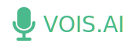

<p align="center">
  
</p>

<p align="center">
  <strong>Transcribe and Examine Speech</strong><br/>
  Copyright &copy; 2018 Caterina Paun
</p>

<p align="center">
  <a href="https://github.com/Web-Audio/web-audio.github.io/blob/master/LICENSE">
    
  </a>
  <a href="https://badge.fury.io/js/npm.svg">
    
  </a>
  <a href="#">
    
  </a>
</p>
<br/>

## 🎙️ What is VOIS.AI 🎙️

VOIS.AI is a web application that transcribes and examines a person's speech, in order to outline important information  about how a person speaks.

The goal of the app is to analyze speech to understand what words a person tends to use too often and what words that person should avoid, such as “like”, well”, “I mean”, etc.

This application is for everyone who wants to learn more about how they speak. We are specifically targeting working professionals who give regular presentations as part of their work.


## 🚀 Getting Started 🚀

1.  Download the code to your local machine.

    ```sh
    # clone the project from the GitHub repo:
    clone https://github.com/Web-Audio/web-audio.github.io
    ```

2.  Install project dependencies.

    ```sh
    # check that you have both Node and npm installed
    node --version
    npm --version

    # install project dependencies
    npm install
    ```

3.  Start a local web server to view to application.

    ```sh
    npm start
    ```

4.  Open the source code and start editing.

    You can view and use the application at the following URL: [http://localhost:3000/index.html](http://localhost:3000/index.html). Any changes you make to your code will need to be saved; the browser will update in real time.


## 🖥️ Contributing to the Project 🖥️

Help is always welcome and appreciated!

#### Issue Tracker

Please submit any issues using the [Issue Tracker](https://github.com/Web-Audio/web-audio.github.io/issues).

#### How to Contribute

Check out this [How to Contribute](https://github.com/Web-Audio/web-audio.github.io/blob/master/CONTRIBUTING.md) guide.

#### Code of Conduct

VOIS.AI is committed to providing a friendly, safe and welcoming environment for all, regardless of gender, sexual orientation, disability, ethnicity, religion, or similar personal characteristic, as outlined in our [Code of Conduct](https://github.com/Web-Audio/web-audio.github.io/blob/master/CODE_OF_CONDUCT.md), which is based on the [Citizen Code of Conduct](http://citizencodeofconduct.org/).

## 🗒️ License 🗒️

This work is licensed under the MIT License. See the file [LICENSE](https://github.com/Web-Audio/web-audio.github.io/blob/master/LICENSE) for the license terms.

## 🙋 Credits 🙋

#### Main Contributor(s)
* <a href="https://github.com/caterinasworld">Caterina Paun</a>

#### Articles Used for this Project
* [HTML5 Speech Recognition API](https://shapeshed.com/html5-speech-recognition-api/)
* [Remove Stop Words in JavaScript](http://geeklad.com/remove-stop-words-in-javascript)
